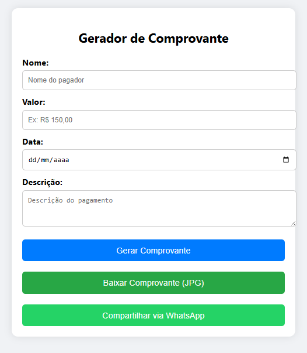
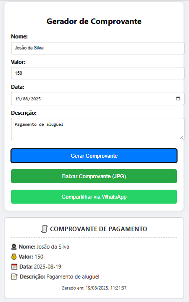
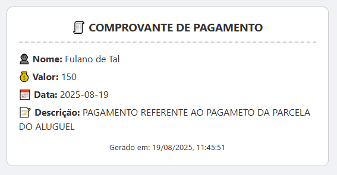

# 🧾 Gerador de Comprovante de Pagamento

Este projeto é uma aplicação web simples e prática para **gerar comprovantes de pagamento personalizados**.  
Com ele, você pode criar um recibo preenchendo os dados básicos, visualizar automaticamente o comprovante, baixá-lo em formato **JPG** ou até compartilhar diretamente pelo **WhatsApp**.

---

## 🚀 Tecnologias Utilizadas

- **HTML5** → Estrutura da aplicação  
- **CSS3** → Estilização moderna e responsiva  
- **JavaScript (ES6)** → Geração dinâmica dos comprovantes  
- **[html2canvas](https://html2canvas.hertzen.com/)** → Captura e exportação do comprovante como imagem JPG  

---

## 🎯 Funcionalidades

✅ Gerar comprovantes com:  
- Nome do pagador  
- Valor do pagamento  
- Data  
- Descrição  

✅ Visualização imediata do comprovante  
✅ Exportar comprovante em **JPG**  
✅ Compartilhar comprovante direto pelo **WhatsApp**  
✅ Layout limpo e responsivo  

---

## 📂 Estrutura do Projeto

├── index2.html # Estrutura completa do app

yaml
Copiar
Editar

---

## ⚡ Como Usar Localmente

1. Clone este repositório:
   ```bash
   git clone https://github.com/ReiBrito/Gerador-Comprovante.git
Acesse a pasta do projeto:

bash
Copiar
Editar
cd Gerador-Comprovante
Abra o arquivo index2.html no navegador:

bash
Copiar
Editar
start index2.html   # Windows
open index2.html    # Mac
xdg-open index2.html # Linux
Preencha os campos (nome, valor, data, descrição) e clique em Gerar Comprovante.

🌐 Demonstração

👉 https://ReiBrito.github.io/Recibo-de-Pagamento/

🖼️ Imagem

* Tela incial
  


* Geração do recibo
  


* Recibo
  


📌 Melhorias Futuras

📤 Exportar em PDF além de JPG

🖨️ Opção de imprimir direto

🎨 Mais opções de personalização (cores, logotipo, assinatura)

☁️ Salvar histórico de comprovantes no navegador

👨‍💻 Autor
Desenvolvido por Reinaldo Brito 

💙 Sinta-se livre para contribuir ou adaptar ao seu uso!
